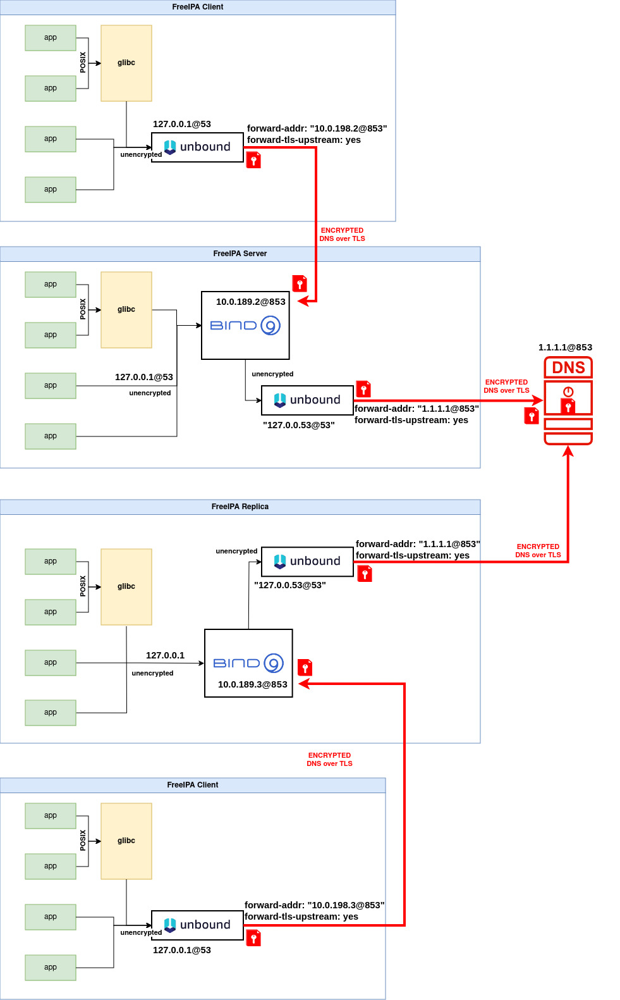

# FreeIPA Integrated DNS Service with DoT Support

Encrypted DNS, also known as DNS over HTTPS (DoH) or DNS over TLS (DoT), is a protocol that encrypts DNS queries and responses exchanged between DNS clients (such as web browsers or applications) and DNS servers. Traditional DNS queries are sent over plaintext connections, which can be intercepted and monitored by malicious actors, posing privacy and security risks.

In modern deployments, the internal network can no longer be trusted, it means that all traffic must be authenticated, authorized and encrypted. Encrypted DNS ensures secure communication by enforcing the use of DoT or DoH methods, encrypting all DNS queries and responses. This feature integrates encrypted DNS seamlessly into the FreeIPA management framework, allowing administrators to decide whether the DNS traffic must be encrypted or not.

FreeIPA now includes support for deploying its integrated DNS service with DoT enabled. This enhancement aligns with modern security standards, providing encrypted communication between DNS clients and the FreeIPA DNS server while retaining the same features and benefits of FreeIPA's DNS integration.

## Goals

The primary goal is to provide a way to deploy integrated DNS server with the enforcement of using DNS over encrypted channels instead of using standard UDP port 53 with unencrypted communication. This means that DNS clients must talk to DNS servers using DoT method that is fully encrypted. The scope for the traffic encryption is for all DNS queries that are leaving the host, while the local communication within the host does not require encryption.

## Initial Considerations
This feature builds upon the existing DNS component in FreeIPA, maintaining its core assumptions and goals while introducing secure communication through DoT. It is designed to enhance FreeIPA's DNS deployment options and address the growing need for encrypted DNS communication.

The deployment of the DNS service will depend on the infrastructure configuration. During server/replica/client deployment or client/replica enrollment, both unencrypted and encrypted communications will be allowed as default. Howerver, for more restrictive scenarios where only encrypted communications are allowed, a new option is needed to enforce this behavior. The option `--dns-policy` will have two choices: relaxed will allow unencrypted DNS queries, while enforced will restrict unencrypted queries on port 53. It is important to mention that when restrict policy is enabled, it will require that DoT be pre-configured on clients and replicas prior to enrollment, ensuring they can connect to the server using port 853.

This initial version of DoT is supported only for new installations/deployments, although administrators can run ipa-dns-install with the DoT options to redeploy the integrated DNS service with DoT enabled on an existing deployment.

Current FreeIPA works with BIND 9.18. This version of BIND doesn't support DoT-forwarding. Therefore, for server/replica deployment, we rely on an additional component, 'unbound', which redirects encrypted DNS queries to the external DNS server. We are already working on upgrading BIND to the most recent LTS version (9.20). Once this upgrade is complete, the design will be simplified by removing unbound as BIND will fully support DoT-forwarding.

## Design

The implementation of DoT in FreeIPA's DNS service leverages the following components:

- BIND with DoT Support: FreeIPA's DNS backend, based on BIND, has been configured and deployed to support DoT. This includes enabling TLS connections on TCP port 853 and managing TLS certificates.

- Certificate Integration: FreeIPA's certificate management framework can be used to generate and manage TLS certificates for the DNS service, or the certificate bundle can be directly provided by the administrator.

- Configuration Management: New LDAP attributes and FreeIPA CLI options are introduced to enable and configure DoT settings.

- Service Discovery: Clients can detect DoT-capable DNS servers directly during the installation process.

The following diagram represents a topology involving FreeIPA Server, Replica and Client:



Note from the diagram that encryption is needed when queries are leaving the machines. When communication happens inside the host only, encryption is not necessary.

FreeIPA currently relies on systemd-resolved as a local cache resolver, which is enabled by default. The new design involves disabling the systemd-resolved service and replacing it with the Unbound service. The client configuration relies exclusively on Unbound, with a DoT forwarder pointing to the DNS server. The FreeIPA server configuration consists of two main components: BIND (named) as an integrated DNS server, accepting both incoming unencrypted queries from localhost and incoming encrypted queries from external traffic, while relying on Unbound for handling outgoing external encrypted traffic. We initially opted for Unbound over systemd-resolved because features such as DoT and DoH are more robust and mature in Unbound. Additionally, proposed changes to Fedora to enhance systemd-resolved were never accepted ([Changes/DNS Over TLS](https://www.fedoraproject.org/wiki/Changes/DNS_Over_TLS), [systemd issue #20801](https://github.com/systemd/systemd/issues/20801), [BZ#1889901](https://bugzilla.redhat.com/show_bug.cgi?id=1889901)).

The FreeIPA replica deployment depends on whether the DNS integrated service is deployed, distinguishing between two use cases: with and without DNS integrated service. A replica with DNS Integrated Service will mimic a client configuration: it will use Unbound with a DoT forwarder pointing to the DNS server. A replica without DNS Integrated Service will mimic a server configuration: it will use BIND for handling incoming unencrypted queries from localhost and encrypted queries from external sources, along with Unbound for outgoing encrypted traffic.

Another important aspect involves the client's ability to execute DNS updates (nsupdate) whenever their IP address changes, thereby keeping their DNS record up-to-date. This communication must also be secured with DoT/DoH. Currently, the client supports nsupdate with TSIG (shared key), GSS-TSIG which relies on GSS-API for obtaining the secret TSIG key, and without authentication. It now needs to support a new deployment using DoT.

Finally, the trust chain is a critical component of setting up a DoT DNS channel as it enables the client to verify the identity of the DNS server and establish a secure and trusted connection for encrypted DNS communication. To enhance flexibility and accommodate varying deployment scenarios, we plan to introduce additional parameters that allow administrators to provide a certificate at FreeIPA installation time by allowing administrator to specify a custom certificate. The new parameter will be optional, giving administrators the choice to either provide a certificate or rely on custodia for certificate auto enrollment if no certificate is provided.


## High-level workflow

Enabling DoT: Administrators enable DoT during initial setup or by updating existing DNS configurations through the CLI.

Certificate Management: FreeIPA generates and assigns TLS certificates to the DNS service. Administrators can also provide custom certificates if needed.

DoT Operations: The DNS server listens for DoT traffic on TCP port 853, providing secure communication to clients.

## How to Use

During the deployment of a FreeIPA server, replica, or client, new options are available to enable DoT support. These options allow administrators to enhance the security of DNS traffic. Here’s how to use the new options:

- Enable DoT: use the `--dns-over-tls` option to enable DoT support during the deployment of clients, servers, or replicas. This option deploys Unbound as a local cache resolver (with /etc/resolv.conf listening on 127.0.0.1) and configures BIND on the server to receive DoT requests. On the client side, only Unbound will be deployed (with /etc/resolv.conf listening on 127.0.0.53). Replica deployment configuration will depend on whether the Integrated DNS service is deployed. If it is, the same server configuration will apply. If the Integrated DNS server is not deployed, the client configuration will apply.

- Specify an Upstream DNS Server with DoT enabled: use the `--dot-forwarder` option to specify the upstream DNS server that supports DoT. The format must be 1.2.3.4#dns.server.test. You still need to specify at least one of --forwarder, --auto-forwarders, or --no-forwarders options for the non-encrypted communication, discovery process, etc..

- DoT Certificates. If you prefer to use a self-generated certificate for DoT in BIND/Unbound, use the `--dns-over-tls-key` and `--dns-over-tls-cert` options. If these options are not specified, the IPA CA will be used to request a new certificate.


### CLI

Overview of the CLI commands for the FreeIPA installers and FreeIPA DNS installers:

Configuring DNS services using ipa-dns-install follows the same principles as installing DNS with the ipa-server-install utility.


| Option | Description                                       |
|:------------------------ | :------------------------------ |
| --dns-over-tls  | enable DNS over TLS support. This option is present on both client and server. It deploys Unbound and configures BIND on the server to receive DoT requests.|
| --dot-forwarder | the upstream DNS server with DoT support. It must be specified in the format 1.2.3.4#dns.server.test|
| --dns-over-tls-key and --dns-over-tls-cert | in case user prefers to have the DoT certificate in BIND generated by themselves. If these are empty, IPA CA is used instead to request a new certificate. |


## Troubleshooting and debugging

No DNS Resolution: 
- Ensure that the DNS server (BIND or Unbound) is running.
- Verify that the DNS server is listening on the correct IP addresses and ports.
- Check the firewall settings to ensure that traffic on port 53 and port 853 is allowed.

Encryption Not Working: 
- Verify that forward-tls-upstream is enabled in Unbound.
- Ensure that tls-cert-bundle or tls-system-cert is correctly configured and accessible.
- Restart the Unbound service after making changes.

Logs Not Showing Detailed Information:
- Increase the verbosity level of logging in the configuration files for both BIND and Unbound.
- Restart the respective services to apply the new logging levels.
- Check the log files for detailed debug information.


### Testing and Debugging Unbound

To test the resolution from Unbound using the unbound-host standalone utility you want to use:

`# unbound-host -C /etc/unbound/conf.d/tls-client.conf example.org`

Then you can go through some configuration checks: ensure that Unbound is configured to use DoT automatically. Check if forward-tls-upstream was enabled and that either tls-cert-bundle or tls-system-cert was used during deployment time, as encryption will not be enabled otherwise. After making changes to the Unbound configuration, restart the Unbound daemon by running:

`# systemctl restart unbound`

Alternatively you can also use bind-utils to verify that resolution works through Unbound:

`# dig @localhost example.org`

For a very basic test of Unbound  using OpenSSL:

`# openssl s_client -connect [::1]:853 -verify_hostname unbound < /dev/null`

Output example:

```
CONNECTED(00000003)
Can't use SSL_get_servername
depth=0 CN = unbound
verify error:num=18:self-signed certificate
verify return:1
depth=0 CN = unbound
verify return:1
---
Certificate chain
 0 s:CN = unbound
   i:CN = unbound
   a:PKEY: rsaEncryption, 3072 (bit); sigalg: RSA-SHA256
   v:NotBefore: Jul 13 18:09:50 2023 GMT; NotAfter: Mar 30 18:09:50 2043 GMT
---
```

### Monitoring Traffic with tcpdump and Wireshark

To watch DNS requests and ensure they are encrypted you can easily use tcpdump to capture traffic on port 53 and port 853:
`# tcpdump -n port 53 or port 853`

Alternatively you can rely on Wireshark for more detailed analysis where:
- Port 53 queries should be visible and decodable.
- Port 853 queries or answers should be encrypted and not decodable.

### Testing and Debugging BIND

Verify that the BIND service is running correctly:

`# systemctl status named`

You can run check tool to verify the BIND configuration:

`# named-checkconf /etc/named.conf`

### Increasing logging verbosity

You can always increase the BIND logging verbosity to debug issues. Edit the BIND configuration file to increase logging levels:

```
logging {
    channel default_debug {
        file "data/named.run";
        severity dynamic;
    };
    category default { default_debug; };
};
```
Restart BIND to apply the changes:
`# systemctl restart named`

and monitor the logs for detailed output:

`# tail -f /var/named/data/named.run`


For Unbound edit /etc/unbound/unbound.conf or create a specific logging configuration file (e.g., /etc/unbound/conf.d/logging.conf):

```
server:
    verbosity: 3
```

Restart Unbound to apply the changes:
`# systemctl restart unbound`

and monitor the Unbound logs for detailed output:

`# tail -f /var/log/unbound/unbound.log`

### Debugging Client-Side or nsupdate Issues

To test nsupdate and ensure that DNS updates are functioning correctly you can increase the verbosity of nsupdate logs for detailed debugging when running an update, you want to provide DoT options:

`# nsupdate -A tlscafile -E tlscertfile -H tlshostname -K tlskeyfile -d -v`
